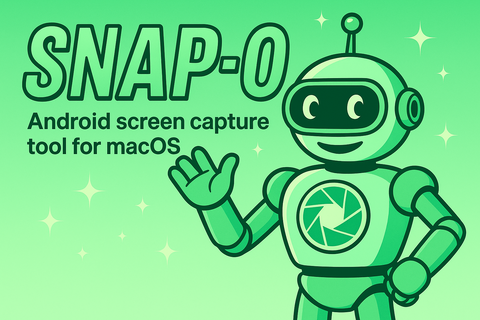

  

# Snap-O: Android Screen Capture Tool

Snap-O is a fast, tidy macOS app for capturing screenshots and screen recordings from Android devices and emulators.

It runs on macOS 15 or later and requires `adb` from the Android Platform Tools.

## Why build a screen capture tool?

Taking screenshots for teammates or pull requests adds many small paper cuts.
You might like Snap-O if you've ever wished you could:

- Share screenshots and recordings without littering your disk with throwaway files
- Preview a recording instantly without saving it first
- Scrub frame by frame to confirm an animation behaves as expected
- Use something that feels faster than the default capture tools

I've built variations of this tool a few times over the last decade; this is the first one
I'm open-sourcing.

## Features

- Shows a screenshot the moment the window opens
- Instantly preview screen recordings, and step through frame-by-frame.
- Lets you drag and drop captures anywhere without saving them first
- Multi-device support
- Supports multiple windows of captures at once
- Keeps your disk uncluttered by cleaning up after itself
- Integrates with Android Studio External Tools

## Usage

1. Connect an Android device with USB debugging enabled or start an emulator
2. Launch Snap-O
3. Enjoy the immediate screenshot
4. `⌘R` to refresh the screenshot. `⇧⌘R` to start a screen recording.

### ADB Selection (optional)

Snap-O talks to the ADB server directly without running `adb`.

If the ADB server is not running, Snap-O asks you to pick your `adb` binary so it can restart the server for you.

Note: Snap‑O uses the macOS Hardened Runtime. It will run the `adb` binary you select, so always choose a trusted `adb` from the official Android Platform Tools.

### Drag and Drop

After you capture a screenshot or screen recording, you can drag and drop it without saving first. Drop the capture straight into a GitHub pull request, a Slack message, or any app that accepts images and video.

### Keyboard Shortcuts

| Action                   | Shortcut |
|--------------------------|----------|
| New screenshot           | `⌘R`     |
| Start recording          | `⇧⌘R`    |
| Start live preview       | `⇧⌘L`    |
| Stop recording / preview | `⎋`      |
| Save as                  | `⌘S`     |
| Copy image to clipboard  | `⌘C`     |
| Previous device          | `⌘[`     |
| Next device              | `⌘]`     |

### Android Studio External Tools

Use Android Studio’s External Tools to trigger Snap-O directly from the IDE.

1. In Android Studio, open `Settings` → `Tools` → `External Tools` (or `Preferences` on macOS).
2. Click `+` and add a new tool named "Snap-O Screenshot".
   - Program: `open`
   - Arguments: `snapo://capture`
3. Repeat to add "Snap-O Recording" with the same Program and the Arguments `snapo://record`.
4. The new tools appear under `Tools` → `External Tools`.
5. Assign keymap shortcuts if you like, e.g. `⇧⌘S` to activate a screenshot.

Running these tools launches Snap-O (or brings it to the foreground) and immediately starts a capture or recording.

There is currently no support for choosing a specific device/emulator when starting Snap-O in this way.

## Why not Compose Multiplatform?

Snap-O uses AVKit because it gives a polished video player on macOS and keeps the download small. VLC-based playback felt clunky and the viewing experience suffered. When Compose Multiplatform lets us use a native player with the same quality, we'll revisit the design.

## Alternatives

Snap-O currently has only basic "Live Preview" support.

For a more feature-rich live preview, take a look at [scrcpy](https://github.com/Genymobile/scrcpy).

## Project status

Snap-O is a small side project kept alive when time allows. If it works for you, great! If it doesn't, feel free to open an issue or fork it to fit your needs.

## Building from source

Building requires Xcode 16 or later.

1. Install the Android Platform Tools (via Android Studio or `brew install android-platform-tools`).
2. Open `Snap-O.xcodeproj` in Xcode.
3. Build and run.

### Notarizing or shipping builds

If you need to notarize the app yourself:

1. Copy `Config/Signing.xcconfig.sample` → `Config/Signing.xcconfig`.
2. Edit the new file with your Apple Developer Team ID and signing certificate name.
3. Archive (⌘B) or upload as usual. The file is ignored by Git, so your credentials remain private.

## Community

Bug reports and small patches are welcome, but there is no formal roadmap. If
you do decide to contribute, please take a quick look at
[CONTRIBUTING.md](CONTRIBUTING.md) and the
[CODE_OF_CONDUCT.md](CODE_OF_CONDUCT.md).

## License

This project is licensed under the Apache License 2.0, Copyright 2025 OpenAI. See the [LICENSE](LICENSE) file for details.
