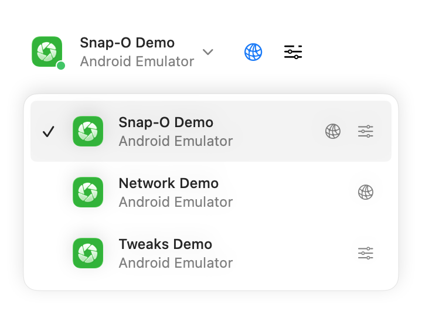

[](https://github.com/openai/snap-o/releases/latest/download/Snap-O.dmg)

<p>
  
</p>

# Snap-O: Android Inspection System

Snap-O is a fast, tidy macOS app for Android inspection. Originally built for streamlined screen capture, Snap-O now also supports network traffic inspection and live UI adjustments on Android devices and emulators.

It runs on macOS 15 or later and requires `adb` from the Android Platform Tools.

## App Inspector

The app picker shows one row per running app process. Click the row to keep your current inspector type when available, or click a Network or Tweaks icon on the right to open that inspector directly. You can also switch inspectors beside the selected app in the toolbar.

<p>
  
  <br><em>Native picker rendered with synthetic demo data.</em>
</p>

## Network Inspector

Curious about mirroring app traffic into the macOS client? Check the [Network Inspector guide](https://openai.github.io/snap-o/network-inspector.html) for setup steps, dependency coordinates, and configuration tips.

Snap-O can replay network requests that happened before you opened Snap-O, so you do not miss early events, and includes collapsible JSON pretty printing.

## Screen Capture

- Shows a screenshot the moment the window opens
- Instantly preview screen recordings, and step through frame-by-frame.
- Lets you drag and drop captures anywhere without saving them first
- Multi-device support
- Supports multiple windows of captures at once
- Keeps your disk uncluttered by cleaning up after itself
- Integrates with Android Studio External Tools

## Tweaks (Alpha)

Snap-O Tweaks lets you inspect and adjust Jetpack Compose UI values or run explicitly registered app-owned actions without rebuilding or restarting your app. It supports numbers, colors, booleans, strings, and type-safe enum pickers. Tweaks is an alpha feature; its APIs, behavior, and interface may change.

```kotlin
import androidx.compose.runtime.Composable
import androidx.compose.runtime.getValue
import com.openai.snapo.tweaks.TweakAction
import com.openai.snapo.tweaks.tweak

@Composable
fun MotionPreview() {
    val duration by tweak(400, "Motion/Duration", 100..1500)
    TweakAction("Motion/Restart animation") { restartAnimation() }
}
```

`TweakAction` returns `Unit` and exposes its callback only while its owner is in composition; declaring the action does not run the callback.

Follow the [Tweaks developer guide](https://openai.github.io/snap-o/tweaks.html) for setup steps.

## Why build an Android inspection system?

Capturing visuals and validating traffic for teammates or pull requests adds many small paper cuts. You might like Snap-O if you've ever wished you could:

- Share screenshots and recordings without littering your disk with throwaway files
- Preview a recording instantly without saving it first
- Scrub frame by frame to confirm an animation behaves as expected
- Use something that feels faster than the default capture tools

I've built variations of this tool a few times over the last decade; this is the first one I'm open-sourcing.

## Usage

1. Connect an Android device with USB debugging enabled or start an emulator
2. Launch Snap-O
3. Enjoy the immediate screenshot
4. `⌘R` to refresh the screenshot. `⇧⌘R` to start a screen recording.

### ADB Selection (optional)

Snap-O talks to the ADB server directly without running `adb`.

If the ADB server is not running, Snap-O asks you to pick your `adb` binary so it can restart the server for you.

Note: Snap‑O uses the macOS Hardened Runtime. It will run the `adb` binary you select, so always choose a trusted `adb` from the official Android Platform Tools.

### Previously adjusted Tweaks

Include previously adjusted ordinary or app-owned values even after their declarations leave composition:

```bash
snapo tweaks list --all -s <serial> -n <socket> --json
snapo tweaks get 'Motion/Duration' --all -s <serial> -n <socket> --json
```

The equivalent API is `GET /tweaks?include=adjusted`. Inactive tweaks remain read-only; app-owned history retains a value snapshot, not its source. See the [Tweaks protocol guide](contracts/tweaks/README.md) for descriptors and updates.

### Drag and Drop

After you capture a screenshot or screen recording, you can drag and drop it without saving first. Drop the capture straight into a GitHub pull request, a Slack message, or any app that accepts images and video.

### Keyboard Shortcuts

| Action                    | Shortcut |
|---------------------------|----------|
| New screenshot            | `⌘R`     |
| Start recording           | `⇧⌘R`    |
| Start live preview        | `⇧⌘L`    |
| Stop recording / preview  | `⎋`      |
| Save as                   | `⌘S`     |
| Copy image to clipboard   | `⌘C`     |
| Previous device           | `⌘[`     |
| Next device               | `⌘]`     |
| Show / hide App Inspector | `⌥⌘I`    |
| Show / hide Capture       | `⌥⌘C`    |

### Android Studio External Tools

Use Android Studio’s External Tools to trigger Snap-O directly from the IDE.

1. In Android Studio, open `Settings` → `Tools` → `External Tools` (or `Preferences` on macOS).
2. Click `+` and add a new tool named "Snap-O Screenshot".
   - Program: `open`
   - Arguments: `snapo://capture`
3. Repeat to add "Snap-O Recording" with the same Program and the Arguments `snapo://record`.
4. The new tools appear under `Tools` → `External Tools`.
5. Assign keymap shortcuts if you like, e.g. `⇧⌘S` to activate a screenshot.

Running these tools launches Snap-O (or brings it to the foreground) and immediately starts a capture or recording.

There is currently no support for choosing a specific device/emulator when starting Snap-O in this way.

### Command Line Inspector

Snap-O bundles a small Python command-line client at:

```bash
/Applications/Snap-O.app/Contents/MacOS/snapo
```

It uses the host computer's configured `adb` command, requires Python 3, and does not require the Snap-O app to be running.

```bash
snapo network list --json
snapo network requests -s <serial> -n <socket> --no-stream --json
snapo network show -s <serial> -n <socket> -r <request-id> --json
snapo network intercept ./prototype.py -s <serial> -n <socket>
snapo tweaks apps --json
snapo tweaks list -s <serial> -n <socket> --json
snapo tweaks set 'Typography/Font size' 42 -s <serial> -n <socket>
snapo tweaks set 'Motion/Marker shape' RoundedSquare -s <serial> -n <socket>
snapo tweaks reset 'Typography/Font size' -s <serial> -n <socket>
snapo tweaks action 'Motion/Toggle animation' -s <serial> -n <socket>
```

### Python API overrides

Use `@route` handlers to prototype API changes in an Android app. This requires an app built with the updated Snap-O OkHttp integration. Older apps report that interception is unsupported.

```python
from snapo import route

@route("GET", "api/profile")
async def profile(call):
    response = await call.upstream()
    response.json["display_name"] = "Space Captain"
    return response

@route("GET", "api/tasks")
async def tasks(call):
    return call.json({"tasks": [{"id": "1", "title": "Example task"}]})
```

Save this as `prototype.py`, then run:

```bash
snapo network intercept prototype.py -s <serial> -n <socket>
```

The runner loads the file and registers its decorated functions. No scenario object or Python package installation is needed. `--check` loads and lists the routes without ADB or a device. `--no-watch` disables file watching. `--timeout 30` sets the handler deadline in seconds, including time spent waiting for the upstream response.

Routes match an exact method and URL path on any host; a leading slash is optional. Query parameters do not affect matching. Inspect `call.request.url` to distinguish hosts or queries. Unmatched requests keep their normal behavior. Handlers run concurrently, so use `await asyncio.sleep(...)` or `asyncio.Event` to explore timing dependencies. Blocking code such as `time.sleep(...)` blocks every Python handler.

`await call.upstream()` sends the original request on Android, using the app's authentication and transport. Repeated calls reuse that response. Edit `response.json`, `response.status`, or `response.headers`, then return it. Reading `response.json` alone preserves the original body bytes and content headers; nested edits are detected when returning the response. `response.body` accepts bytes. `call.json(value, status=201)` creates a synthetic response without contacting the server. `call.request.json` reads a JSON request body. Changes to the request object do not rewrite the original request.

Module variables provide shared state. A successful file reload resets that state for new calls. In-flight calls finish with their original handlers and state. Invalid edits leave the previous handlers active. Only the entry file is watched; restart the runner after changing imported helpers.

Stopping the runner removes its routes and fails paused calls. Handler errors and deadlines fail the affected request; they never cause the runner to send it upstream as a fallback. The app's own retry policy still applies. Each connection manages its own routes. Reloading, disabling, or disconnecting one runner leaves other runners active. If routes overlap, one matching handler runs; selection order is unspecified. Ordinary inspectors may remain connected.

The initial implementation supports bounded HTTP bodies up to 1 MiB. Request bodies must be repeatable and declare their size. Requests accepting SSE bypass interception, and unexpected SSE responses fail without buffering the stream. WebSocket and HttpURLConnection traffic remain inspection-only. For larger uploads or streaming protocols, use the normal network path. The inspector shows the response delivered to the app; it does not yet show a before/after diff.

The API follows the fetch-and-replace pattern used by [Playwright routes](https://playwright.dev/python/docs/api/class-route): `call.upstream()` fetches the original response, and returning a response completes the override. [mitmproxy addons](https://docs.mitmproxy.org/stable/addons/overview/) similarly use Python handlers and reload scripts. These tools have different APIs rather than a shared interception standard. Snap-O keeps exact method/path decorators and a returned response because requests run through the Android app's existing transport; it does not emulate a browser or require a proxy certificate.

See [examples/routes.py](examples/routes.py) for response edits, shared state, and delays, and the [interception protocol](contracts/network/interception.md) for transport details.

## Why a web UI for the App Inspector?

The Network and Tweaks inspectors share a React UI hosted in the macOS app's system WebKit runtime. Native Swift code handles ADB and transport through the host computer's existing ADB server, so the distribution does not include Chromium, Node.js, or another ADB executable. The same UI can also run in a browser through its HTTP transport.

The screenshot tool remains in SwiftUI because it delivers a better macOS experience for video playback today. Snap-O uses AVKit because it gives a polished video player on macOS and keeps the download small. VLC-based playback felt clunky and the viewing experience suffered.

## Alternatives

Snap-O currently has only basic "Live Preview" support.

For a more feature-rich live preview, take a look at [scrcpy](https://github.com/Genymobile/scrcpy).

## Project status

Snap-O is a small side project kept alive when time allows. If it works for you, great! If it doesn't, feel free to open an issue or fork it to fit your needs.

## Building from source

The macOS app requires Xcode 26 or later and Node.js 22.12 or later.

1. Install the Android Platform Tools (via Android Studio or `brew install android-platform-tools`).
2. Install Node.js 22.12 or later and ensure `npm` is available to Xcode.
3. Open `snapo-app-mac/Snap-O.xcodeproj` in Xcode.
4. Build and run.

### Notarizing or shipping builds

If you need to notarize the app yourself:

1. Copy `snapo-app-mac/Config/Signing.xcconfig.sample` → `snapo-app-mac/Config/Signing.xcconfig`.
2. Edit the new file with your Apple Developer Team ID and signing certificate name.
3. Use Xcode's Product → Archive flow, then distribute or upload as usual. The file is ignored by Git, so your credentials remain private.

## Codex Plugin

Snap-O includes a Codex plugin for macOS and Linux. It bundles skills for network inspection and live Tweaks, along with their shared Python CLI, and requires Python 3 and Android Platform Tools.

Add the Snap-O marketplace and install the plugin:

```bash
codex plugin marketplace add openai/snap-o --ref main
codex plugin add snap-o@snap-o
```

If you previously installed this marketplace with sparse paths, migrate once:

```bash
codex plugin marketplace remove snap-o
codex plugin marketplace add openai/snap-o --ref main
codex plugin add snap-o@snap-o
```

Refresh the marketplace and reinstall the plugin to pick up updates:

```bash
codex plugin marketplace upgrade snap-o
codex plugin add snap-o@snap-o
```

Start a new Codex session after installing or updating the plugin.

## Linux Support

You can inspect network requests and alpha Tweaks from Snap-O on a Linux machine by using the dependency-free `snapo` Python CLI tool. Install Python 3 and Android Platform Tools, then download the script from the `main` branch and put it on `PATH`:

```bash
mkdir -p ~/.local/bin
curl -fsSL https://raw.githubusercontent.com/openai/snap-o/main/scripts/snapo -o ~/.local/bin/snapo
chmod +x ~/.local/bin/snapo
```

This is the same CLI shipped as part of the macOS app at `Snap-O.app/Contents/MacOS/snapo`.

Python API overrides are included in the same standalone script. No checkout or extra Python package is required.

The script supports `snapo network list`, `requests`, and `show`, as well as `snapo tweaks apps`, `list`, `get`, `set`, `action`, `reset`, and `watch`. It resolves `adb` from `PATH`, `ANDROID_SDK_ROOT`, or `ANDROID_HOME`; use `--adb <path>` or `SNAPO_ADB` to select a specific ADB executable or wrapper. By default, server selection is left to the configured ADB command, which normally connects to `127.0.0.1:5037`. Pass `--adb-host <host> --adb-port <port>` to use an explicit remote ADB server.

Verify that ADB can see your Android device, then inspect its available Snap-O servers:

```bash
adb devices -l
snapo network list --json
snapo tweaks apps --json
```

With the default ADB configuration, the CLI opens a localhost forward for the selected `snapo_network_<pid>` or `snapo_tweaks_<pid>` socket and removes it when the command exits. Wrappers selecting a remote ADB server must tunnel that forward back to localhost; otherwise, specify `--adb-host` and `--adb-port`. With an explicit ADB endpoint, the CLI connects through the ADB server directly and does not create a forward. Treat captured bodies, URL query values, and editable tweaks as sensitive.

For slow remote wrappers, `--adb-timeout 90` increases the per-command ADB deadline from its 30-second default. Values must be greater than zero and at most 90 seconds. This deadline is separate from the Python handler's `--timeout`. Repeated shutdown signals leave forward cleanup running until it finishes or reaches the ADB deadline.

## Community

Bug reports and small patches are welcome, but there is no formal roadmap. If you do decide to contribute, please take a quick look at [CONTRIBUTING.md](CONTRIBUTING.md) and the [CODE_OF_CONDUCT.md](CODE_OF_CONDUCT.md).

## License

This project is licensed under the Apache License 2.0, Copyright 2025 OpenAI. See the [LICENSE](LICENSE) file for details.
